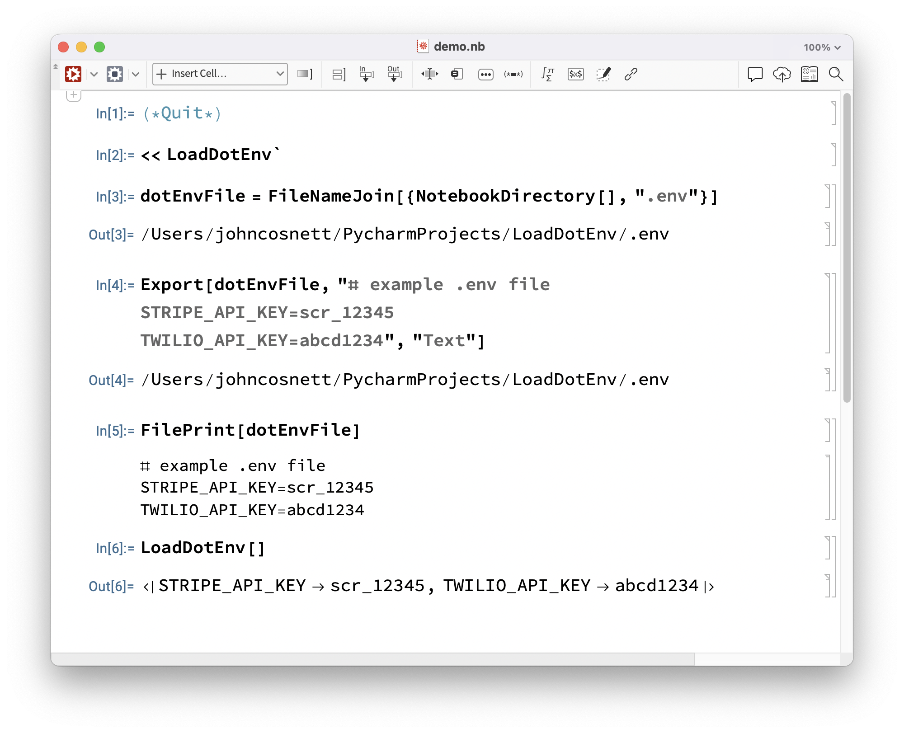

# LoadDotEnv

Load environment variables from `.env` files into a Wolfram Language session.

## Usage

### Loading

To use `LoadDotEnv`, load the package with `<<` (assumes `LoadDotEnv.wl` is in the same directory):

```mathematica
<< LoadDotEnv`
```

### Running LoadDotEnv

Once loaded, call `LoadDotEnv[]` to read the `.env` file in the current working directory:

```mathematica
env = LoadDotEnv[]
```

This returns an `Association` of key-value pairs, e.g.:

```mathematica
<| "STRIPE_API_KEY" -> "scr_12345", "TWILIO_API_KEY" -> "abcd1234" |>
```

To load a `.env` file at a specific path:

```mathematica
env = LoadDotEnv["/path/to/project/.env"]
```

You can then access individual values with normal `Association` lookup:

```mathematica
env["STRIPE_API_KEY"]
```

### Viewing Documentation

After loading the file, call `?LoadDotEnv` to see the usage string:

```mathematica
?LoadDotEnv
```

## demo.nb notebook



## Limitations

It handles:
- Unquoted `key=value` pairs
- Comment lines (starting with `#`)
- Blank lines

Not yet supported: quoted values, multi-line values, variable expansion, the `export` prefix, or UTF-8 BOM stripping.

## References

- [Loading .env files in Wolfram Language — Mathematica Stack Exchange](https://mathematica.stackexchange.com/q/318952/36681)
- [The .env File Format — dotenv.org](https://www.dotenv.org/docs/security/env.html)
- [Loading .env files in Wolfram Language — Wolfram Community](https://community.wolfram.com/groups/-/m/t/3653796)
- [python-dotenv — GitHub](https://github.com/theskumar/python-dotenv)

## Source Code

The implementation of `LoadDotEnv` can be found in [`LoadDotEnv.wl`](LoadDotEnv.wl).
